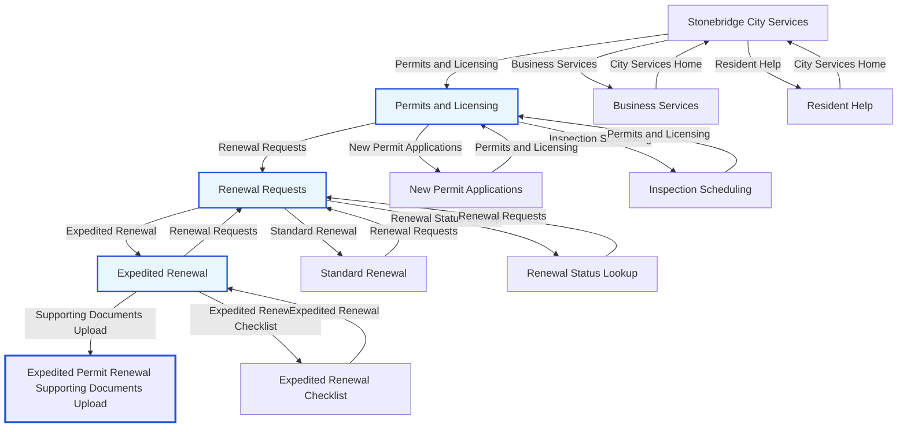

# Trajectory: heuristic / permit_renewal

- Score: `0.990`
- Path: `city_home -> permits_center -> renewal_requests -> expedited_renewal -> expedited_permit_renewal_supporting_documents_upload`

```mermaid
graph TD
    node_city_home["Stonebridge City Services"]
    class node_city_home start,visited
    node_city_home -->|"Permits and Licensing"| node_permits_center:::pathEdge
    node_city_home -->|"Business Services"| node_business_services
    node_city_home -->|"Resident Help"| node_resident_help
    node_permits_center["Permits and Licensing"]
    class node_permits_center visited
    node_permits_center -->|"Renewal Requests"| node_renewal_requests:::pathEdge
    node_permits_center -->|"New Permit Applications"| node_new_permit_applications
    node_permits_center -->|"Inspection Scheduling"| node_inspection_scheduling
    node_renewal_requests["Renewal Requests"]
    class node_renewal_requests visited
    node_renewal_requests -->|"Expedited Renewal"| node_expedited_renewal:::pathEdge
    node_renewal_requests -->|"Standard Renewal"| node_standard_renewal
    node_renewal_requests -->|"Renewal Status Lookup"| node_renewal_status_lookup
    node_expedited_renewal["Expedited Renewal"]
    class node_expedited_renewal visited
    node_expedited_renewal -->|"Supporting Documents Upload"| node_expedited_permit_renewal_supporting_documents_upload:::pathEdge
    node_expedited_renewal -->|"Expedited Renewal Checklist"| node_expedited_renewal_checklist
    node_expedited_renewal -->|"Renewal Requests"| node_renewal_requests
    node_new_permit_applications["New Permit Applications"]
    node_new_permit_applications -->|"Permits and Licensing"| node_permits_center
    node_inspection_scheduling["Inspection Scheduling"]
    node_inspection_scheduling -->|"Permits and Licensing"| node_permits_center
    node_standard_renewal["Standard Renewal"]
    node_standard_renewal -->|"Renewal Requests"| node_renewal_requests
    node_renewal_status_lookup["Renewal Status Lookup"]
    node_renewal_status_lookup -->|"Renewal Requests"| node_renewal_requests
    node_business_services["Business Services"]
    node_business_services -->|"City Services Home"| node_city_home
    node_resident_help["Resident Help"]
    node_resident_help -->|"City Services Home"| node_city_home
    node_expedited_renewal_checklist["Expedited Renewal Checklist"]
    node_expedited_renewal_checklist -->|"Expedited Renewal"| node_expedited_renewal
    node_expedited_permit_renewal_supporting_documents_upload["Expedited Permit Renewal Supporting Documents Upload"]
    class node_expedited_permit_renewal_supporting_documents_upload target,visited
    classDef start fill:#d8f3dc,stroke:#2d6a4f,stroke-width:2px;
    classDef target fill:#ffe5d9,stroke:#bc3908,stroke-width:3px;
    classDef visited fill:#e9f5ff,stroke:#1d4ed8,stroke-width:2px;
    classDef pathEdge stroke:#1d4ed8,stroke-width:3px;
```
