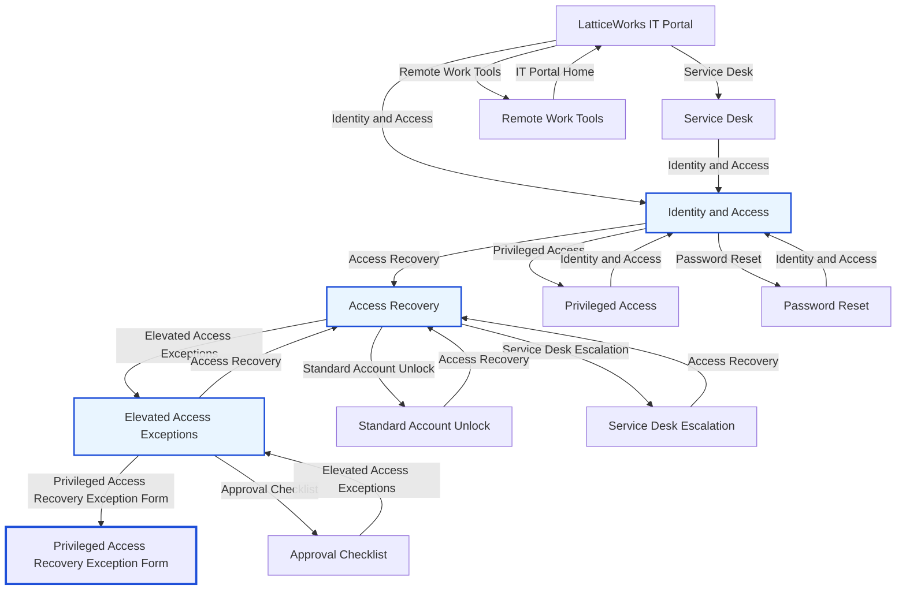

# Trajectory: oracle / it_access_recovery

- Score: `0.990`
- Path: `it_home -> identity_access -> access_recovery -> elevated_access_exceptions -> privileged_access_recovery_exception_form`

```mermaid
graph TD
    node_it_home["LatticeWorks IT Portal"]
    class node_it_home start,visited
    node_it_home -->|"Identity and Access"| node_identity_access:::pathEdge
    node_it_home -->|"Service Desk"| node_service_desk
    node_it_home -->|"Remote Work Tools"| node_remote_work_tools
    node_identity_access["Identity and Access"]
    class node_identity_access visited
    node_identity_access -->|"Access Recovery"| node_access_recovery:::pathEdge
    node_identity_access -->|"Privileged Access"| node_privileged_access
    node_identity_access -->|"Password Reset"| node_password_reset
    node_access_recovery["Access Recovery"]
    class node_access_recovery visited
    node_access_recovery -->|"Elevated Access Exceptions"| node_elevated_access_exceptions:::pathEdge
    node_access_recovery -->|"Standard Account Unlock"| node_standard_account_unlock
    node_access_recovery -->|"Service Desk Escalation"| node_service_desk_escalation
    node_elevated_access_exceptions["Elevated Access Exceptions"]
    class node_elevated_access_exceptions visited
    node_elevated_access_exceptions -->|"Privileged Access Recovery Exception Form"| node_privileged_access_recovery_exception_form:::pathEdge
    node_elevated_access_exceptions -->|"Approval Checklist"| node_approval_checklist
    node_elevated_access_exceptions -->|"Access Recovery"| node_access_recovery
    node_privileged_access["Privileged Access"]
    node_privileged_access -->|"Identity and Access"| node_identity_access
    node_password_reset["Password Reset"]
    node_password_reset -->|"Identity and Access"| node_identity_access
    node_standard_account_unlock["Standard Account Unlock"]
    node_standard_account_unlock -->|"Access Recovery"| node_access_recovery
    node_service_desk["Service Desk"]
    node_service_desk -->|"Identity and Access"| node_identity_access
    node_service_desk_escalation["Service Desk Escalation"]
    node_service_desk_escalation -->|"Access Recovery"| node_access_recovery
    node_remote_work_tools["Remote Work Tools"]
    node_remote_work_tools -->|"IT Portal Home"| node_it_home
    node_approval_checklist["Approval Checklist"]
    node_approval_checklist -->|"Elevated Access Exceptions"| node_elevated_access_exceptions
    node_privileged_access_recovery_exception_form["Privileged Access Recovery Exception Form"]
    class node_privileged_access_recovery_exception_form target,visited
    classDef start fill:#d8f3dc,stroke:#2d6a4f,stroke-width:2px;
    classDef target fill:#ffe5d9,stroke:#bc3908,stroke-width:3px;
    classDef visited fill:#e9f5ff,stroke:#1d4ed8,stroke-width:2px;
    classDef pathEdge stroke:#1d4ed8,stroke-width:3px;
```
